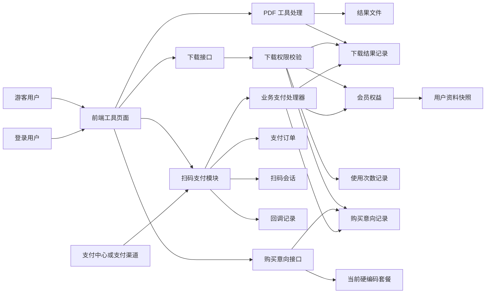
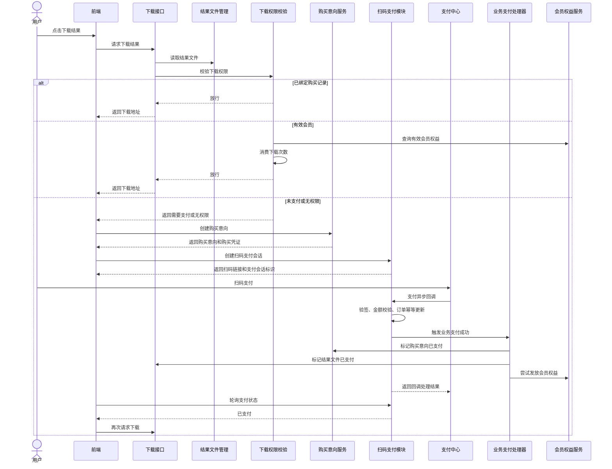
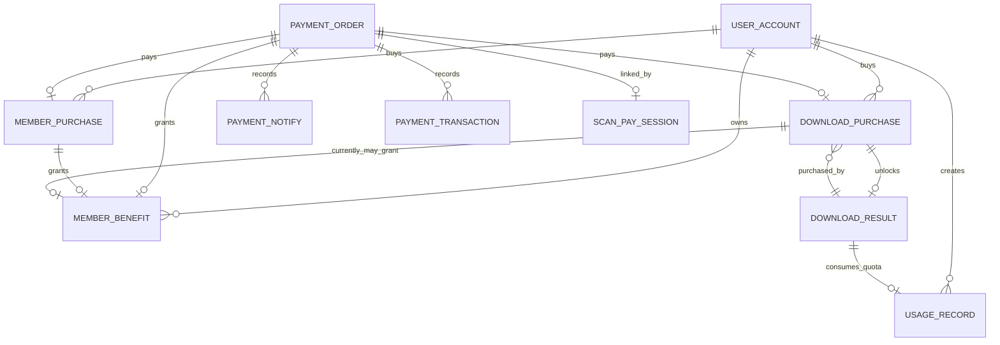
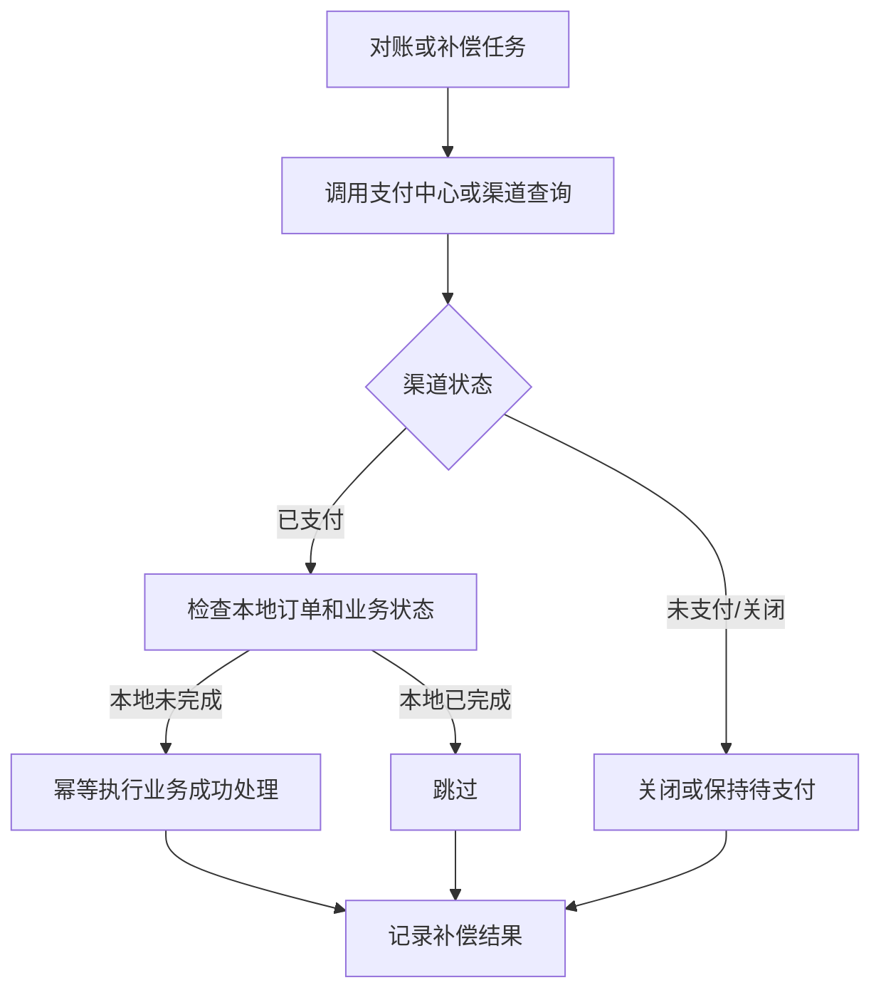

# PDF 工具平台支付与会员体系设计复盘

> 本文是一次脱敏后的项目复盘。文档不包含公司名称、真实域名、真实表名、真实订单号和真实生产配置，可作为 GitHub 技术笔记或面试项目复盘材料使用。

## 0. 复盘背景

当前项目是一个 PDF 工具平台，核心业务是用户上传或直传文件，平台执行 PDF 处理、文档转换或图片处理，生成结果文件。商业化能力围绕两个方向展开：

1. 结果文件下载前拦截，未满足条件时引导支付。
2. 会员购买后获得有效期和每日下载次数权益。

这次复盘来源于一次支付与会员功能评审。评审意见集中在几个点：

1. 价格不应该写死。
2. 会员权益不应该写死。
3. 支付补偿任务设计存在问题。
4. 会员权益补偿任务设计存在问题。
5. 支付回调本身应该保证事务一致性。
6. 补偿任务必须有可靠数据来源。
7. 当前业务场景可能存在过度设计。

这几个意见本质上不是单点代码问题，而是支付系统设计中最关键的几个问题：商品配置、权益配置、支付状态可信来源、回调幂等、事务边界、补偿边界和复杂度控制。

## 1. 业务理解

### 1.1 当前业务模型

当前平台可以抽象成七个业务域：

| 业务域 | 当前职责 | 关键判断 |
| --- | --- | --- |
| 用户体系 | 管理游客、登录用户、免费用户、付费用户状态 | 用户身份是游客还是登录用户，会员状态是否有效 |
| 游客支付逻辑 | 支持未登录用户先创建购买意向，支付后再绑定账号 | 游客凭证是否可靠，绑定窗口是否合理 |
| 登录绑定逻辑 | 登录后把游客支付记录绑定到当前用户 | 是否只能绑定自己的购买凭证，是否已绑定其他账号 |
| 会员体系 | 记录会员购买、开通权益、到期、续费、升级 | 权益是否有效，套餐等级和有效期如何计算 |
| 下载次数体系 | 记录工具使用次数和会员下载次数消费 | 单次付费下载和会员扣次口径必须分清 |
| 支付体系 | 统一创建扫码支付、记录订单、处理回调、触发业务处理 | 支付订单状态必须以支付回调或支付渠道查询为准 |
| 文件下载体系 | 登记结果文件，下载前校验权限，返回下载地址 | 文件是否存在、过期、已付费、归属当前用户 |

### 1.2 业务架构图



### 1.3 当前业务口径中的混杂点

当前实现里，“单次结果购买”和“会员套餐购买”没有完全拆开：

1. 付费下载购买记录里保存的是会员套餐编码、套餐名称和套餐金额。
2. 付费下载支付成功后，不只是放开某个结果文件，还会尝试发放会员权益。
3. 会员权益服务使用了付费下载套餐枚举来解析权益。
4. 存在历史会员支付处理器，会从订单标题中反推套餐。

这会导致后续很难回答几个基础问题：

1. 用户买的是“某个文件的一次下载权限”，还是“会员套餐”？
2. 单次购买是否应该消耗会员次数？
3. 付费下载订单是否应该出现在会员充值记录里？
4. 退款时应该取消下载权限，还是取消会员权益？

这也是本次复盘里最重要的业务结论：在支付系统里，商品定义必须先清晰，支付链路才能清晰。

## 2. 支付链路梳理

### 2.1 从点击下载开始的实际链路

根据当前代码，下载入口的实际链路如下：

1. 用户点击下载结果文件。
2. 下载接口先根据结果文件标识读取临时文件信息。
3. 下载接口进入付费下载校验。
4. 校验结果文件是否存在、是否过期。
5. 如果当前登录用户已经购买并绑定该结果，允许下载。
6. 如果当前登录用户是有效会员，检查并消费会员下载次数，允许下载。
7. 如果结果已支付但不属于当前用户，拒绝下载。
8. 如果结果未支付，返回需要支付的业务错误。
9. 前端收到需要支付后，创建购买意向。
10. 前端用购买意向创建扫码支付会话。
11. 用户扫码后，支付模块创建公共支付订单并跳转支付中心。
12. 支付中心回调平台。
13. 平台验签、校验金额、更新支付订单、写回调记录。
14. 平台根据业务类型调用对应业务处理器。
15. 业务处理器更新购买意向、下载结果和会员权益。
16. 前端轮询支付状态成功后，再次触发下载。

一个需要特别注意的当前事实：下载接口当前要求登录。因此“游客先支付、再下载”的完整闭环实际上依赖后续登录绑定；如果没有绑定，下载接口本身不会允许游客直接下载。

### 2.2 当前代码时序图



### 2.3 当前支付回调已经做了什么

当前回调并不是完全没有一致性设计。实际代码里已经包含：

1. 回调验签。
2. 订单号解析。
3. 支付订单存在性校验。
4. 重复支付回调幂等判断。
5. 支付金额一致性校验。
6. 支付订单从待支付到已支付的条件更新。
7. 支付流水记录。
8. 扫码会话状态更新。
9. 业务处理器回调。
10. 回调处理记录保存。

因此，真正的问题不是“回调没有做事”，而是：在已经有回调事务的情况下，又新增了多个定时补偿任务，并且这些任务主要读取本地库状态进行修复，没有独立可信的支付状态来源。这会让评审人员质疑：既然支付回调应该保证一致性，为什么还要再靠多个任务修本地状态？

## 3. 数据库设计分析

以下表均使用脱敏后的逻辑表名，不使用真实表名。

### 3.1 当前核心表设计

#### 3.1.1 用户表

| 字段 | 作用 | 评价 |
| --- | --- | --- |
| user_id | 用户主键 | 合理 |
| user_type | FREE / PAID 快照 | 可用于快速展示，但不能作为真实会员判断来源 |
| paid_at | 最近付费时间 | 可用于展示和审计 |

风险点：

1. user_type 是冗余快照，真实会员状态应该以会员权益表为准。
2. 如果权益过期但 user_type 没有降级，会出现展示与真实权限不一致。

#### 3.1.2 使用限制配置表

| 字段 | 作用 | 评价 |
| --- | --- | --- |
| tool_code | 工具编码 | 合理 |
| user_type | GUEST / FREE / PAID | 合理 |
| max_file_size | 文件大小限制 | 合理 |
| daily_limit | 每日次数限制 | 合理 |
| result_retention_minutes | 结果保留时间 | 合理 |

优点：

1. 使用限制已经配置化，这是正确方向。
2. 可以按工具和用户类型做不同限制。

风险点：

1. 这是资源限制配置，不应该和会员套餐权益配置混为一谈。
2. 会员每日下载次数如果直接写在套餐枚举中，会和这里的配置形成双重口径。

#### 3.1.3 使用记录表

| 字段 | 作用 | 评价 |
| --- | --- | --- |
| user_id | 登录用户 | 合理 |
| user_type | 当次使用用户类型 | 合理，但属于快照 |
| tool_code | 工具编码 | 合理 |
| request_id | 请求或任务标识 | 合理 |
| status | STARTED / SUCCESS / FAILED 等 | 合理 |
| executed_flag | 是否实际执行 | 有助于排查 |
| fail_reason | 失败原因 | 合理 |

风险点：

1. 下载次数和工具使用次数要分清，否则用户“生成结果”和“下载结果”会被重复计数。
2. 会员下载次数消费需要保证同一结果重复下载不重复扣次。

#### 3.1.4 下载结果表

| 字段 | 作用 | 评价 |
| --- | --- | --- |
| result_id | 结果文件唯一标识 | 合理，应该唯一 |
| tool_code | 工具编码 | 合理 |
| user_id / visitor_id | 文件归属 | 合理，但游客绑定要谨慎 |
| file_name / file_path | 文件信息 | 合理 |
| pay_status | UNPAID / PAID / REFUNDED 等 | 合理，但职责偏多 |
| order_no | 关联支付订单号 | 可追踪，但建议关联支付订单 ID |
| expire_time | 文件过期时间 | 合理 |
| has_consumed_quota | 是否已消耗会员次数 | 合理，用于防重复扣次 |
| usage_record_id | 对应用量记录 | 合理 |

风险点：

1. 同一张表同时承载文件状态、支付状态、下载状态、扣次状态，职责偏重。
2. 文件路径如果是本地临时路径，服务重启或清理后可能无法下载。
3. pay_status 不能单独证明支付成功，真实依据应该来自支付订单或支付渠道。

#### 3.1.5 单次下载购买意向表

| 字段 | 作用 | 评价 |
| --- | --- | --- |
| result_id | 购买哪个结果文件 | 合理 |
| user_id | 登录用户 | 合理 |
| plan_code / plan_name | 当前存了套餐 | 存在语义风险 |
| amount | 下单金额快照 | 合理 |
| pay_status | 业务支付状态 | 合理 |
| payment_order_id / order_no | 公共支付订单引用 | 合理 |
| purchase_token | 游客绑定凭证 | 合理，但要防泄露 |
| bind_status / bind_time | 游客支付后绑定状态 | 合理 |
| refund_amount / refund_time | 退款信息 | 合理 |

风险点：

1. 如果这是单次结果购买，就不应该使用会员套餐编码。
2. 如果这是会员购买，就不应该绑定 result_id。
3. 当前它同时承担“下载购买”和“会员权益来源”，容易造成业务语义混乱。

#### 3.1.6 会员购买表

| 字段 | 作用 | 评价 |
| --- | --- | --- |
| user_id | 购买用户，可为空支持游客 | 合理 |
| visitor_token | 游客身份凭证 | 合理，但需要绑定窗口 |
| purchase_token | 购买绑定凭证 | 合理 |
| plan_code / plan_name | 购买套餐快照 | 合理 |
| amount | 下单金额快照 | 合理 |
| pay_status | PENDING / PAID / CLOSED / REFUNDED | 合理 |
| payment_order_id / order_no | 公共支付订单引用 | 合理 |
| bind_status / bind_time | 游客绑定状态 | 合理 |
| paid_time | 支付完成时间 | 合理 |

优点：

1. 会员购买意向独立建表是正确的。
2. 支付成功后再发放权益，具备业务追踪基础。
3. 支持游客购买后绑定，产品体验更灵活。

风险点：

1. 价格来源来自枚举，不是配置表。
2. 游客支付后超过绑定窗口如何处理，需要明确客服和退款策略。
3. 购买表和权益表必须通过 source_order 做唯一幂等约束。

#### 3.1.7 会员权益表

| 字段 | 作用 | 评价 |
| --- | --- | --- |
| user_id | 权益归属用户 | 合理 |
| plan_code / plan_name | 权益套餐快照 | 合理 |
| benefit_status | ACTIVE / EXPIRED / CANCELLED | 合理 |
| start_time / expire_time | 权益有效期 | 合理 |
| daily_limit | 每日可用次数快照 | 合理，但来源应配置化 |
| source_biz_type | 来源业务类型 | 合理 |
| source_order_id / source_order_no | 权益来源订单 | 合理，是幂等关键 |

优点：

1. 用来源订单做权益幂等是正确方向。
2. daily_limit 作为权益快照是合理的，可以保留历史购买时权益。

风险点：

1. 权益来源如果既可以是会员购买，也可以是单次下载购买，需要业务语义统一。
2. daily_limit 从硬编码枚举来，后续改套餐权益必须发版。
3. 多条 ACTIVE 权益并存时，需要明确“最高等级优先”还是“时间叠加”。

#### 3.1.8 公共支付订单表

| 字段 | 作用 | 评价 |
| --- | --- | --- |
| order_no | 平台订单号 | 合理，应该唯一 |
| user_id | 支付用户 | 合理，匿名场景需允许为空或匿名主体 |
| biz_type | 业务类型 | 合理 |
| biz_ref_id | 业务记录 ID | 合理，但无物理外键 |
| amount / payable_amount / real_pay_amount | 金额字段 | 合理 |
| pay_status | pending / paid / failed / cancelled / refunded | 合理 |
| pay_channel | 支付渠道 | 合理 |
| subject | 商品标题 | 合理，但不能反推核心业务 |
| paid_at | 支付完成时间 | 合理 |
| expired_at | 订单过期时间 | 合理 |

优点：

1. 支付订单统一化是正确方向。
2. biz_type + biz_ref_id 可以复用多个业务支付场景。
3. 回调时做金额校验和状态幂等更新是正确的。

风险点：

1. biz_ref_id 是多态引用，不容易做数据库外键。
2. user_id 在匿名支付场景下需要设计清楚，不能强行要求登录又允许游客购买。
3. 订单标题只能用于展示，不能作为权益解析依据。

#### 3.1.9 扫码会话表

| 字段 | 作用 | 评价 |
| --- | --- | --- |
| sign | 扫码会话标识 | 合理 |
| order_id | 关联支付订单 | 合理 |
| biz_type / biz_ref_id | 业务引用 | 合理 |
| subject / payable_amount | 展示金额 | 合理 |
| scan_count / max_scan_count | 扫码次数控制 | 合理 |
| status | waiting / scanned / paid / expired | 合理 |
| expired_at | 过期时间 | 合理 |

风险点：

1. 并发扫码创建订单时需要保证只绑定一个支付订单，当前已有条件更新处理。
2. 扫码状态不是支付最终状态，最终仍应以支付订单和渠道状态为准。

#### 3.1.10 支付回调记录表

| 字段 | 作用 | 评价 |
| --- | --- | --- |
| order_id / order_no | 对应支付订单 | 合理 |
| biz_type / biz_ref_id | 业务引用 | 合理 |
| channel_trade_no | 渠道流水号 | 合理 |
| notify_data | 原始回调参数 | 合理，但注意脱敏 |
| notify_status | SUCCESS / FAIL / IGNORED | 合理 |
| fail_reason | 失败原因 | 合理 |

优点：

1. 回调记录是排障和审计基础，必须保留。
2. 重复回调记录为 IGNORED 是合理的。

风险点：

1. 原始回调数据不能存敏感明文。
2. 回调成功记录不能替代渠道查询，尤其是做对账和补偿时。

### 3.2 当前 ER 图



### 3.3 字段设计结论

设计合理的字段：

1. 支付订单的 biz_type + biz_ref_id。
2. 支付订单的 payable_amount / real_pay_amount。
3. 回调记录的 notify_status / fail_reason。
4. 会员权益的 source_order_id / source_order_no。
5. 购买意向的 purchase_token / bind_status。
6. 下载结果的 result_id / expire_time。
7. 下载结果的 has_consumed_quota / usage_record_id。

冗余但可以接受的字段：

1. user_type：作为展示快照可以保留，但不能作为权限真相。
2. plan_name：作为购买快照可以保留，避免套餐改名影响历史订单。
3. amount：作为下单快照可以保留，真实价格来源应来自下单时的服务端配置。
4. order_no 同时出现在业务表和支付表：便于排查，但要明确支付表是主来源。

未来风险较高的字段：

1. plan_code 如果没有套餐配置表，会导致权益和价格长期硬编码。
2. subject 如果用于解析套餐，会导致支付标题变更影响业务。
3. pay_status 如果在多个业务表重复维护，会出现状态不一致。
4. visitor_token 如果生命周期和安全边界不清，会导致绑定争议。
5. file_path 如果依赖本地临时路径，会受服务重启和清理影响。

## 4. 设计缺陷复盘

### 4.1 为什么价格写死是问题

当前价格在后端枚举和前端展示中固定。短期看实现快，长期会带来明显问题：

1. 价格调整必须发版，运营不能独立改。
2. 前后端价格可能不一致，用户看到和实际支付不一致。
3. 无法支持限时活动、灰度价格、渠道价格和优惠券。
4. 无法做价格生效时间和历史价格审计。
5. 面试或评审中会被认为商品模型不完整。

支付系统里，前端价格永远只能展示，不能作为可信价格来源。后端也不应该把价格散落在枚举里，而应该从商品或套餐配置中读取，下单后把金额写入订单快照。

### 4.2 为什么会员权益写死是问题

当前权益包括有效天数、每日次数、套餐等级等，主要来自枚举。问题是：

1. 权益调整必须发版。
2. 新增套餐必须改代码。
3. 同一套餐的历史购买权益和新购买权益无法区分。
4. 无法配置不同工具的不同权益。
5. 无法解释“30 天会员每天 5 次”和使用限制配置表之间的关系。

更好的方式是：套餐配置表负责商品价格和有效期，权益配置表负责每日次数、工具范围、是否无限、是否可叠加等。会员权益表保存购买当时的权益快照。

### 4.3 为什么套餐应该配置化

套餐配置化至少要解决四件事：

1. 商品定义：套餐编码、套餐名称、价格、有效天数、等级、状态。
2. 上架状态：是否可购买、展示顺序、生效时间。
3. 历史追踪：订单记录购买当时的价格快照。
4. 运维能力：不改代码就能停用或调整套餐。

推荐的逻辑模型：

| 逻辑表 | 作用 |
| --- | --- |
| plan_config | 套餐主配置，定义价格、有效期、等级、上下架 |
| plan_right_config | 套餐权益配置，定义工具范围、次数、文件大小等 |
| purchase_record | 用户购买意向和支付状态 |
| benefit_record | 支付成功后的权益快照 |

### 4.4 为什么权益应该配置化

权益和价格不是一个概念。价格回答“多少钱”，权益回答“买到什么”。如果只用一个枚举同时表示价格和权益，会让系统失去弹性。

权益配置化后可以支持：

1. 不同套餐每天下载次数不同。
2. 不同工具有不同次数。
3. 终身会员是否无限可配置。
4. 后续支持文件大小、并发数、保留时长等权益。
5. 支持历史权益快照，不影响老订单。

### 4.5 为什么支付补偿任务被质疑

支付补偿任务当前的核心问题是：它主要扫描本地支付订单、回调记录和业务表，然后修复业务状态。

这个设计会被质疑，因为：

1. 本地支付订单已支付，本身就是回调处理后的结果，不能作为外部真实支付状态的独立来源。
2. 如果回调事务已经失败并回滚，本地订单不一定是 paid。
3. 如果本地订单是 paid 但业务没成功，说明回调事务边界或业务处理边界本身需要修。
4. 定时任务会掩盖回调链路的缺陷，让问题从实时失败变成延迟修复。
5. 多个任务同时修同一批状态，容易形成职责重叠。

一句话：本地扫描任务可以做“内部一致性修复”，但不能叫支付补偿。真正的支付补偿必须有支付渠道或支付中心的可信查询结果。

### 4.6 为什么会员权益补偿任务被质疑

会员权益补偿任务扫描已支付会员购买记录，再补发权益。它的问题在于：

1. 支付成功后发放权益本来应该在回调事务里完成。
2. 如果权益发放失败，应通过回调重试或事件重试解决，而不是定时扫描所有已支付记录。
3. 会员权益是强业务结果，延迟补发会直接影响用户体验。
4. 如果没有唯一幂等约束，补偿任务可能重复发放权益。
5. 如果已有唯一幂等约束和回调事务，再加定时任务的收益有限。

正确的思路是：先保证支付回调成功路径具备事务一致性和幂等性；如果还需要异步重试，应基于明确失败事件或 outbox 事件，而不是无差别扫描。

### 4.7 支付回调应该承担哪些职责

支付回调至少应该承担：

1. 验签，确认回调来源可信。
2. 校验订单存在。
3. 校验金额一致。
4. 校验支付状态是否可流转。
5. 幂等处理重复回调。
6. 更新支付订单状态。
7. 记录支付流水和原始回调。
8. 调用业务成功处理。
9. 确保业务结果可追踪。
10. 对失败返回明确结果，让支付中心重试或人工排查。

对于当前项目，如果支付订单、购买意向、会员权益、下载结果都在同一个数据库里，回调可以用本地事务保证支付订单和业务状态一起提交。如果未来拆成多个服务，则应该使用 outbox 或可靠消息，不应该直接跨服务大事务。

### 4.8 事务边界应该放在哪里

当前单体或同库场景推荐事务边界：

```text
支付回调事务
  1. 验签和金额校验
  2. 支付订单 pending -> paid 条件更新
  3. 写支付流水
  4. 更新购买意向 paid
  5. 更新下载结果 paid 或发放会员权益
  6. 写回调处理记录
提交事务
```

注意：

1. 条件更新必须防重复回调。
2. 权益表必须有来源订单唯一约束。
3. 用户 user_type 更新只是快照，不是核心权益判断。
4. 如果业务处理失败，事务应该回滚，并让回调返回失败或记录明确失败事件。

### 4.9 什么场景下才需要补偿任务

补偿任务不是不能有，但必须满足条件。

合理场景：

1. 支付渠道提供订单查询接口，平台可以按订单号查询真实支付状态。
2. 支付中心提供对账单，平台可以按对账单修复本地缺失状态。
3. 本地使用 outbox 事件，回调事务已提交支付成功事件，但事件消费失败。
4. 第三方回调确实存在网络失败，并且支付平台不会无限重试。

不合理场景：

1. 只扫描本地业务表，猜测应该修复。
2. 以本地 paid 状态作为支付成功的唯一依据。
3. 用定时任务掩盖回调事务设计问题。
4. 不知道任务走什么接口获取真实订单状态。

### 4.10 补偿任务如何获得可信状态来源

可信来源优先级：

1. 支付渠道订单查询接口。
2. 支付中心订单查询接口。
3. 支付渠道对账单。
4. 已持久化且同事务提交的 outbox 事件。
5. 本地回调原始记录，仅可辅助排查，不能单独证明最终支付成功。

推荐补偿流程：



### 4.11 如果未来接微信支付或支付宝正式环境应该如何设计

正式环境建议：

1. 支付模块抽象统一网关，屏蔽微信、支付宝差异。
2. 每个渠道必须实现创建订单、关闭订单、查询订单、退款、查询退款、验签。
3. 回调必须按渠道验签和证书规则处理。
4. 平台订单号和渠道交易号都要唯一保存。
5. 金额必须以后端订单金额为准，回调金额必须完全一致。
6. 重复回调用平台订单号和渠道交易号幂等处理。
7. 对账任务必须从渠道账单或渠道查询接口获取状态。
8. 退款和权益取消要独立设计，不能只把支付状态改成 refunded。
9. 业务处理失败要有 outbox 或失败事件记录。
10. 所有支付配置必须走配置中心或环境变量，不能写入代码和文档。

## 5. 从当前实现到推荐实现

### 5.1 当前方案

当前方案可以概括为：

1. 使用公共扫码支付模块统一创建支付订单和接收回调。
2. 业务侧通过支付业务处理器处理会员购买和付费下载。
3. 会员套餐价格和权益主要写在枚举中。
4. 会员购买和付费下载购买都有独立购买意向。
5. 支付成功后同步更新购买记录、下载结果和会员权益。
6. 额外增加了多个定时任务扫描本地库修复支付和权益状态。

### 5.2 当前方案优点

1. 支付主链路已经接入公共支付模块，比业务自建支付网关更合理。
2. 回调中已有验签、金额校验、幂等更新和业务处理器。
3. 购买意向表让业务订单可追踪。
4. 会员权益表提供了权益有效期和来源订单。
5. 游客购买后绑定能力考虑了实际用户体验。
6. 下载结果表能做到下载前拦截。

### 5.3 当前方案缺点

1. 价格写死在枚举和前端，缺少套餐配置表。
2. 权益写死在枚举，缺少权益配置表。
3. 单次下载购买和会员购买语义混杂。
4. 付费下载购买后也会发放会员权益，产品口径不清。
5. 历史会员支付处理器从订单标题反推套餐，风险较高。
6. 多个补偿任务基于本地状态扫描，缺少可信外部状态来源。
7. 下载接口要求登录，与游客先支付的体验存在链路断点。
8. 下载结果表职责较重，混合了文件、支付、扣次、下载状态。

### 5.4 推荐方案

推荐按“先收口，再配置化，再引入可信补偿”迁移。

#### 第一阶段：收口主链路

1. 保留公共支付回调作为唯一主路径。
2. 暂停或下线支付补偿、会员权益补偿、下载结果补偿这类本地扫描任务。
3. 明确支付成功后业务处理必须在回调事务或 outbox 事件中完成。
4. 删除或隔离历史会员支付处理器的标题反推套餐逻辑。
5. 明确单次下载购买和会员购买的边界。

#### 第二阶段：套餐配置化

新增逻辑配置：

| 配置 | 字段建议 |
| --- | --- |
| 套餐配置 | plan_code、plan_name、price、valid_days、level、status、sort_order |
| 权益配置 | plan_code、tool_code、daily_limit、file_size_limit、retention_minutes、unlimited_flag |

下单时：

1. 后端从配置读取价格。
2. 生成购买记录并保存价格快照。
3. 支付订单金额来自购买记录快照。
4. 前端只展示后端返回价格。

#### 第三阶段：重构权益发放

会员购买成功：

1. 购买记录 pending -> paid。
2. 根据套餐和权益配置生成会员权益快照。
3. 以支付订单作为来源唯一键，保证重复回调不重复发放。
4. 用户资料表只更新展示快照。

单次下载购买成功：

1. 购买记录 pending -> paid。
2. 下载结果标记为 paid。
3. 不发放会员权益。
4. 下载时校验购买记录归属。

#### 第四阶段：引入真正补偿或对账

如果接入正式支付：

1. 对账任务调用支付中心或渠道查询接口。
2. 只根据外部可信状态修复本地订单。
3. 本地业务补偿必须调用同一个幂等业务成功处理方法。
4. 任务输出补偿证据，包含外部状态来源、订单、处理结果。

### 5.5 迁移成本

| 改造项 | 成本 | 说明 |
| --- | --- | --- |
| 暂停本地扫描补偿任务 | 低 | 配置或调度层下线即可，但要保留回滚方案 |
| 套餐配置表 | 中 | 需要 SQL、初始化数据、查询服务、前端展示接口 |
| 权益配置表 | 中 | 需要权益发放逻辑读取配置并生成快照 |
| 单次下载和会员购买拆分 | 中高 | 需要调整前端弹窗文案、购买意向和回调处理 |
| 正式支付渠道查询和对账 | 高 | 需要渠道参数、证书、签名、对账任务和异常处理 |
| 清理历史支付入口 | 中 | 需要确认是否还有用户或入口依赖 |

## 6. 架构成长总结

### 6.1 这次项目学到了什么

站在刚毕业的 Java 后端 / AI 研发工程师视角，这次项目最重要的收获不是写出了支付代码，而是理解了支付系统不能只看“能不能跑通”。

这次学到的核心点：

1. 支付系统最重要的是状态可信来源。
2. 回调必须幂等，重复回调是常态。
3. 支付金额必须以后端为准。
4. 商品价格和权益不能长期写死。
5. 会员权益是支付成功后的业务结果，不是用户表一个字段。
6. 补偿任务不是越多越可靠。
7. 事务边界比代码层次更重要。
8. AI 给出的通用方案必须结合项目实际评审。

### 6.2 哪些设计是第一次接触

1. 公共支付订单和业务订单分离。
2. 业务处理器模式。
3. 支付回调验签。
4. 支付金额校验。
5. 支付成功幂等更新。
6. 会员权益来源订单幂等。
7. 游客支付后绑定账号。
8. 下载结果先生成、下载时付费拦截。
9. 会员次数消费防重复扣减。
10. 支付补偿、对账和 outbox 的区别。

### 6.3 新人容易踩的坑

1. 把“定时任务补偿”当成可靠性的万能方案。
2. 没有外部可信状态来源，就扫描本地库修复支付状态。
3. 把价格写在枚举里，以为后端写死就安全。
4. 把权益写在枚举里，忽略运营配置和历史快照。
5. 用订单标题反推套餐。
6. 单次购买和会员购买没有分清。
7. 支付成功后先改订单，再发权益，失败后没有重试路径。
8. 用户表 user_type 和真实会员权益状态混用。
9. 前端展示价格和后端支付价格没有统一来源。
10. 为了防异常加很多任务，反而让架构更难解释。

### 6.4 哪些方案属于过度设计

当前场景中，以下内容偏过度：

1. 同时存在支付补偿、会员权益补偿、下载结果补偿多个任务。
2. 任务主要靠本地状态推断，没有外部支付查询接口。
3. 单次下载购买还尝试发放会员权益。
4. 历史会员处理器兼容逻辑过多，甚至从标题解析套餐。
5. 在产品口径未定时提前设计复杂匿名支付绑定。

更务实的最小闭环应该是：

1. 登录后购买会员。
2. 支付回调事务内发权益。
3. 权益表做来源唯一幂等。
4. 下载时查有效权益或单次购买记录。
5. 真正接入渠道查询后，再做对账补偿。

### 6.5 AI 为什么会推荐这些方案

AI 容易推荐补偿任务，原因是它见过很多分布式系统常见模式，例如：

1. 定时补偿。
2. 最终一致性。
3. 异步重试。
4. outbox。
5. 对账任务。

但 AI 不一定知道当前项目的真实约束：

1. 当前是否是单体同库。
2. 支付中心是否保证回调重试。
3. 是否有支付渠道查询接口。
4. 评审团队是否接受本地扫描补偿。
5. 当前业务是否真的复杂到需要多任务兜底。

所以 AI 给出的是“通用可靠性模式”，但工程落地必须由人判断模式是否适合当前项目。

### 6.6 为什么 AI 生成方案仍然需要人工评审

支付系统属于高风险业务，AI 不能替代人工评审，原因是：

1. AI 不承担线上资金损失责任。
2. AI 可能把通用模式套到不合适的场景。
3. AI 很难知道公司内部支付中心的真实能力。
4. AI 可能低估评审人员对事务一致性的要求。
5. AI 可能为了“保险”引入过度设计。
6. AI 不能确认真实数据、真实渠道、真实配置。

AI 适合做资料整理、方案比较、风险清单和代码初稿，不适合独立决定支付架构。

## 7. 支付系统设计经验清单

以后再设计支付系统，优先检查以下问题：

### 7.1 商品与价格

1. 商品是什么：会员、单次下载、次数包，必须先定义清楚。
2. 价格来源必须在后端。
3. 价格应该配置化。
4. 订单必须保存下单时价格快照。
5. 前端价格只用于展示。

### 7.2 权益

1. 买完后用户获得什么权益必须明确。
2. 权益应该配置化。
3. 权益发放必须幂等。
4. 权益表要保存来源订单。
5. 用户资料字段只能作为展示快照。

### 7.3 支付回调

1. 必须验签。
2. 必须校验金额。
3. 必须处理重复回调。
4. 必须记录原始回调。
5. 必须明确事务边界。
6. 回调成功才代表本地业务状态已经可靠落库。

### 7.4 事务与幂等

1. 支付订单状态更新要用条件更新。
2. 业务购买记录状态更新要用条件更新。
3. 权益发放要有来源订单唯一约束。
4. 下载扣次要保证同一结果不重复扣。
5. 失败时要能明确重试，不靠猜测修复。

### 7.5 补偿与对账

1. 补偿必须有可信状态来源。
2. 最可信来源是支付渠道或支付中心查询。
3. 本地库扫描只能做内部一致性检查，不能证明支付成功。
4. outbox 重试和支付对账不是一回事。
5. 不要用多个补偿任务掩盖主链路事务问题。

### 7.6 游客支付

1. 游客凭证必须有生命周期。
2. 支付后绑定必须防止被其他账号绑定。
3. 游客支付后未绑定要有客服或退款策略。
4. 如果下载接口要求登录，就不要宣传游客支付后可直接下载。
5. 匿名支付是否被公共支付模块支持，需要先确认。

### 7.7 文件下载

1. 下载前必须校验文件存在。
2. 下载前必须校验文件未过期。
3. 下载权限要区分会员、单次购买和免费次数。
4. 文件路径不要长期依赖本地临时内存映射。
5. 文件已删除但数据库仍可下载的问题要有清理策略。

### 7.8 面试表达

如果在面试中讲这段项目，可以这样总结：

> 我在项目里接入过 PDF 结果付费下载和会员权益体系。第一次设计时，我把支付补偿和会员权益补偿做得偏复杂，后来复盘发现：在单体同库场景下，主链路应该优先保证支付回调事务一致性和幂等性；补偿任务只有在有支付中心或渠道查询这种可信来源时才成立。这个项目让我真正理解了支付系统里的商品配置、权益快照、回调幂等、事务边界和对账补偿之间的区别。

## 8. 最终结论

当前系统不是完全错误，它已经具备了支付主链路、购买意向、会员权益、下载拦截、游客绑定和幂等雏形。真正的问题在于：

1. 商品和权益模型没有配置化。
2. 单次下载购买和会员购买边界不清。
3. 额外补偿任务缺少可信支付状态来源。
4. 本应由回调事务保证的一致性，被多个本地扫描任务分散了职责。

推荐下一步不是继续堆补偿，而是先做架构收口：

1. 明确商品模型。
2. 套餐和权益配置化。
3. 回调事务内完成业务成功处理。
4. 用来源订单做幂等。
5. 正式支付接入后，再基于渠道查询或对账单做真正补偿。

这次经验最核心的价值是：支付系统设计不能只追求“看起来更保险”，而要能回答“谁是状态真相、事务在哪里提交、重复调用如何幂等、失败后靠什么可信数据恢复”。
