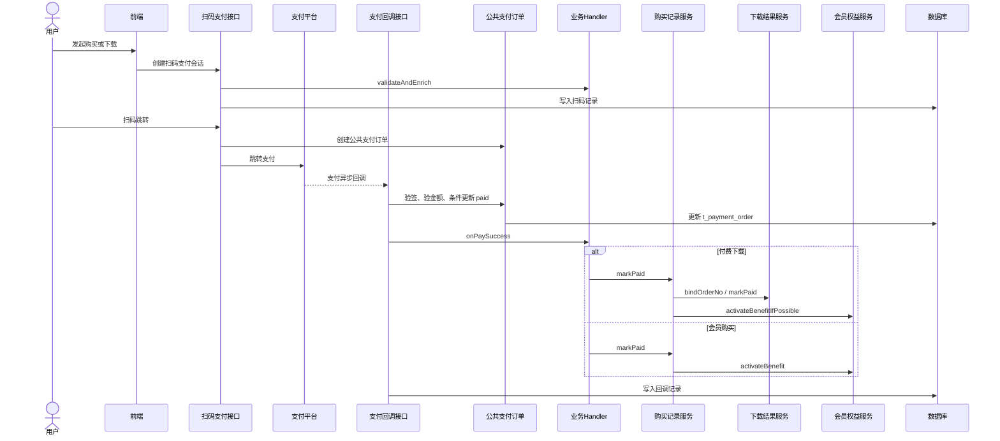
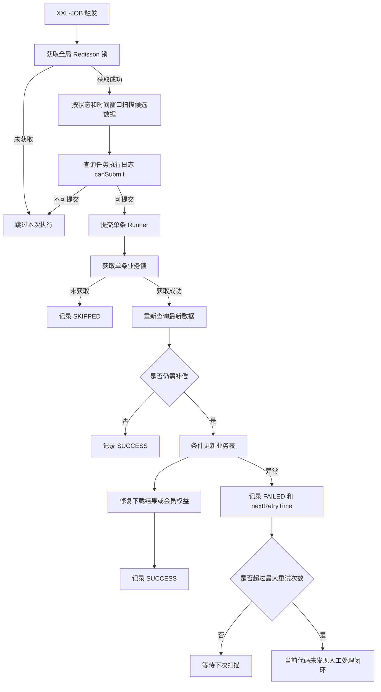

# 基于 XXL-JOB 的支付与会员权益补偿机制复盘

> 本文是一份脱敏后的工程复盘，基于 PDF 工具平台中真实存在的 4 个 XXL-JOB 任务整理。文档不包含公司名称、内部域名、IP、密钥、账号、密码和真实生产配置。文中保留的类名、方法名、字段名仅用于说明工程设计和复盘思路。

## 1. 项目背景

PDF 工具平台的核心业务是：用户上传或直传文件，平台执行 PDF 处理、文档转换、图片处理等任务，生成结果文件。结果文件在下载前会经过权限校验，可能涉及免费次数、会员权益、单次付费或结果文件过期清理。

在这个链路里，我设计并实现了 4 个 XXL-JOB 任务：

| 任务名称 | 主要职责 |
| --- | --- |
| `paymentCompensateJobHandler` | 扫描本地已经确认支付成功的公共支付订单，补齐后续业务状态 |
| `memberBenefitCompensateJobHandler` | 扫描已支付会员购买记录，补发或修复会员权益 |
| `paidDownloadResultCompensateJobHandler` | 修复付费下载购买记录、下载结果表、旧订单表之间的状态不一致 |
| `usageFileCleanupJobHandler` | 清理过期下载结果、转换任务记录、本地文件和 OBS 对象 |

这 4 个任务不是为了介绍 XXL-JOB 怎么使用，而是围绕真实业务中的几个问题：

1. 支付回调完成后，业务状态是否一定完全一致；
2. 会员权益是否可能重复发放；
3. 下载结果和购买记录是否可能状态不一致；
4. 文件清理是否可能误删、漏删或删库不删文件；
5. 补偿任务是否真的有必要，还是过度设计。

## 2. 为什么仅依赖支付回调不够

正常支付主链路应该由支付回调实时完成：

1. 支付平台回调业务系统；
2. 系统验签；
3. 校验金额；
4. 条件更新公共支付订单；
5. 根据 `bizType` 分发业务 Handler；
6. 更新购买记录；
7. 发放会员权益或更新下载结果；
8. 记录回调处理结果。

对应代码：

- `ScanPayController.notify`
- `ScanPayService.processNotify`
- `ScanPayService.markOrderPaidOnce`
- `PaidDownloadPayBizHandler.onPaySuccess`
- `MemberPayBizHandler.onPaySuccess`
- `MembershipPayBizHandler.onPaySuccess`
- `PaidDownloadPurchaseServiceImpl.markPaid`
- `MemberPurchaseServiceImpl.markPaid`
- `MemberBenefitServiceImpl.activateBenefit`

从设计原则上说，支付回调是实时主链路。补偿任务不能替代支付回调，更不能成为第二套支付主链路。

但支付回调内部并不是只改一张表。它会涉及公共支付订单、购买记录、下载结果、会员权益、用户状态、回调记录等多张表。一旦业务 Handler 中间抛异常、服务重启、数据库写入异常，或者历史表结构演进导致新旧状态没有完全同步，就可能出现本地局部成功、业务状态未完全完成的问题。

这也是我当初设计补偿任务的出发点：兜底本地已经确认支付成功后的业务一致性问题。

但是，这里有一个很重要的边界：当前 `paymentCompensateJobHandler` 并没有调用第三方支付查询接口。它扫描的是本地已经 `paid` 的公共支付订单。因此它不能完整解决“第三方已经支付，但本系统完全没有收到回调，本地订单仍是 pending”的场景。

如果要解决真正的回调完全丢失，应该单独设计“支付查询补单”或“对账任务”，并调用支付中心或支付渠道的查询接口。

## 3. 四个 XXL-JOB 任务清单

| 任务名称 | 业务职责 | 扫描条件 | 执行动作 | 风险 |
| --- | --- | --- | --- | --- |
| `paymentCompensateJobHandler` | 本地公共支付订单已支付后，补齐业务状态 | `t_payment_order.f_pay_status = paid`，`bizType` 属于付费下载、会员购买或历史会员；更新时间早于延迟窗口 | 补 `t_paid_download_purchase`、`t_paid_download_result`、`t_paid_download_order`、`t_member_purchase`、`t_member_benefit` | 名称容易被误解为“查询第三方支付补单”；与后两个补偿任务存在重叠 |
| `memberBenefitCompensateJobHandler` | 补发或修复会员权益 | `t_member_purchase.f_pay_status = PAID`，有 `userId`，有 `orderNo`，更新时间早于延迟窗口 | 检查权益来源订单；不存在则创建权益；存在但状态异常则修复 | 与支付补偿里的会员权益修复重叠 |
| `paidDownloadResultCompensateJobHandler` | 补齐付费下载结果状态 | `t_paid_download_purchase.f_pay_status = PAID`，或结果表存在待修复状态 | 修复 `t_paid_download_result`、`t_paid_download_order`、购买绑定状态和 `usageRecordId` | 与支付补偿里的下载结果修复重叠 |
| `usageFileCleanupJobHandler` | 清理过期结果和任务记录 | `t_paid_download_result.f_expire_time < now`，以及任务创建时间早于保留窗口 | 删除受控目录文件、OBS 对象、结果记录、任务记录 | 清理动作不可逆，需要严格路径校验和日志 |

## 4. 支付实时主链路

这条链路中，关键幂等点是 `ScanPayService.markOrderPaidOnce`，它只允许公共支付订单从 `pending` 条件更新为 `paid`。重复回调会被识别为已支付并记录为忽略。

## 5. 定时补偿链路

当前 3 个补偿任务的共同特点是：扫描本地已经具备支付成功事实的数据，再修复业务状态。

注意：这张图里没有“查询第三方支付平台”节点，因为当前真实代码没有这个动作。

## 6. 主链路与补偿链路的职责边界

正确边界应该是：

- 支付回调负责实时处理；
- 补偿任务负责最终一致性；
- 回调与补偿必须复用同一套核心业务语义；
- Handler 只负责编排、加锁和提交 Runner；
- 补偿任务只能处理明确异常状态；
- 补偿任务不能用来掩盖回调事务设计问题。

当前实现中，4 个任务的 Handler 基本只做编排：

- `PaymentCompensateJobHandler.execute`
- `MemberBenefitCompensateJobHandler.execute`
- `PaidDownloadResultCompensateJobHandler.execute`
- `UsageFileCleanupJobHandler.execute`

真正业务逻辑在 Service：

- `PaymentCompensateTaskService`
- `MemberBenefitCompensateTaskService`
- `PaidDownloadResultCompensateTaskService`
- `UsageFileCleanupTaskService`

这个分层是合理的。但支付、权益、下载结果三个补偿 Service 之间职责边界不够清楚，是后面被质疑的核心原因。

## 7. 幂等设计

### 7.1 已经实现的幂等点

1. 公共支付订单条件更新  
   `ScanPayService.markOrderPaidOnce` 按 `id + pending` 更新为 `paid`。

2. 重复回调处理  
   `ScanPayService.processNotify` 检测到订单已经 `paid` 时，写 `IGNORED` 回调记录并返回成功。

3. 业务购买记录条件更新  
   `PaidDownloadPurchaseServiceImpl.markPurchasePaidOnce` 和 `MemberPurchaseServiceImpl.markPurchasePaidOnce` 都基于当前状态做条件更新。

4. 权益来源订单判断  
   `MemberBenefitServiceImpl.activateBenefit` 先通过 `sourceOrderId` 或 `sourceOrderNo` 查询是否已经发放过权益。

5. 唯一索引脚本  
   `scripts/sql/payment_member_benefit_idempotency.sql` 和 `scripts/sql/member-benefit-paid-download-safety-indexes.sql` 提供了 `t_member_benefit.f_source_order_id`、`f_source_order_no` 的唯一约束建议。

6. DuplicateKey 兜底  
   `MemberBenefitServiceImpl`、`PaymentCompensateTaskService`、`MemberBenefitCompensateTaskService` 都捕获了 `DuplicateKeyException`。

7. 分布式锁  
   四个 Handler 有全局锁，Runner 有单条业务锁。

8. 任务执行日志  
   `t_task_job_execution_log` 使用 `(job_name, biz_type, biz_key)` 唯一键，记录状态、失败原因、重试次数和下次重试时间。

### 7.2 当前缺口

唯一索引脚本存在，不代表目标数据库一定执行过。公开复盘里只能说“仓库中存在建议脚本”，不能说“线上已经具备唯一约束”。

`TaskJobExecutionLogService.canSubmit` 对 `SUCCESS` 返回 `true`，所以任务日志不是“成功后禁止再执行”的硬闸门，仍依赖业务侧 `needsCompensation` 判断。

Runner 中“无需补偿”和“补偿成功”都记录为 `SUCCESS`，排障时需要结合业务日志判断到底有没有真实修复数据。

## 8. 时间窗口与扫描策略

三个补偿任务都设置了延迟窗口，避免扫描刚刚创建或仍在回调处理中数据：

| 任务 | 默认延迟 | 默认批量 | 最大批量 |
| --- | --- | --- | --- |
| 支付补偿 | 2 分钟 | 100 | 500 |
| 会员权益补偿 | 2 分钟 | 100 | 500 |
| 付费下载结果补偿 | 2 分钟 | 100 | 500 |
| 文件清理 | 60 分钟保留窗口 | 200 或 Handler 默认 500 | 1000 |

代码证据：

- `payment.compensate.delay-minutes`
- `member-benefit.compensate.delay-minutes`
- `paid-download-result.compensate.delay-minutes`
- `usage.file-cleanup.default-result-retention-minutes`
- `resolveLimit`
- `resolveCutoffTime`

优点：

1. 避免扫描刚创建的数据；
2. 单次执行有上限；
3. 先扫描候选，再进行精确判断；
4. 失败后有重试间隔和最大重试次数。

风险：

1. 不是游标分页，而是 `orderBy + LIMIT`；
2. 部分过滤逻辑会逐条查询业务表，存在 N+1；
3. 超过最大重试次数后，当前代码未发现明确的人工处理状态；
4. 没有告警闭环。

## 9. 文件和异常任务清理

`usageFileCleanupJobHandler` 负责清理过期下载结果和任务记录。它和前三个补偿任务不同，不处理支付状态，而是处理文件生命周期。

主要处理对象：

- `t_paid_download_result`
- PDF 转换任务；
- 文档转换任务；
- 图片处理任务；
- PDF 签名任务；
- PDF 去水印任务；
- 本地受控目录；
- OBS 对象。

关键安全措施：

1. 通过 `UsageManagedFileResolver` 解析受控文件；
2. 删除本地文件前校验受控根目录；
3. `resolveCleanupDirectory` 避免删除根目录本身；
4. OBS Key 通过 `isSafeObjectKey` 拒绝绝对路径、协议前缀、反斜杠和 Windows 盘符；
5. 文件不存在时删除数据库记录；
6. 删除失败时只记录失败，不强行删记录；
7. 有批量限制和任务执行日志。

当前风险：

1. 清理是不可逆动作；
2. OBS 删除失败只记日志，当前代码未发现独立人工处理队列；
3. API 模块里还有相似的 `UsageFileCleanupServiceImpl`，长期维护可能出现两套清理规则分叉；
4. 删除后页面是否仍展示可下载，依赖查询时是否重新检查结果记录和文件存在性。

## 10. 被质疑后的设计复盘

这次设计里最重要的一段经历，是任务被直接质疑：

> 支付补偿和会员权益补偿是什么，不是在支付回调里面做的吗？  
> `paidDownloadResultCompensateJobHandler` 这个也是，这是什么？  
> 回调怎么可能丢失？补偿走了什么接口获取订单状态？

这个质疑非常关键。它不是简单否定定时任务，而是指出了我当时设计说明里的几个真实问题。

### 10.1 我最初解释里不严谨的地方

我一开始解释“支付补偿”时，说它用于处理：

- 支付成功但回调丢失；
- 回调异常；
- 订单状态没更新。

但从当前代码看，`PaymentCompensateTaskService.listCompensableOrders` 扫描的是本地已经 `paid` 的公共支付订单，以及本地 `notify_status = SUCCESS` 的回调记录。

也就是说，当前 `paymentCompensateJobHandler` 没有调用第三方支付查询接口。

所以它真实能处理的是：

- 本地公共支付订单已经是 `paid`；
- 但业务购买记录没有同步为 `PAID`；
- 或下载结果没有标记 `PAID`；
- 或会员权益没有发放；
- 或用户付费状态快照没有更新。

它不能完整处理的是：

- 第三方已经支付；
- 本系统完全没有收到回调；
- 本地公共支付订单仍然是 `pending`。

评审里问“走了什么接口获取订单状态”，这个问题是对的。如果没有第三方查询接口，就不能说这个任务能解决回调完全丢失。

### 10.2 被质疑的核心不是“不能有补偿”

补偿任务本身不是不能做。真正的问题是：

1. 补偿任务的前置状态没有说清楚；
2. 支付补偿和业务状态补偿混在一起讲；
3. 任务命名太大；
4. 三个补偿任务职责重叠；
5. 没有明确说明当前不查询第三方支付状态。

在支付系统里，“支付状态补偿”和“业务状态补偿”必须分开：

| 类型 | 可信数据来源 | 当前是否实现 |
| --- | --- | --- |
| 支付状态补偿 | 支付中心或支付渠道查询接口、对账单 | 当前代码未发现 |
| 业务状态补偿 | 本地已 `paid` 订单、回调成功记录、业务状态机 | 当前 3 个补偿任务实现的是这个 |

### 10.3 为什么会显得像过度设计

这次被质疑，主要是因为 3 个任务看起来都在修支付后的状态。

`paymentCompensateJobHandler` 已经会补：

- 付费下载购买记录；
- 下载结果；
- 旧订单表；
- 会员购买记录；
- 会员权益。

`memberBenefitCompensateJobHandler` 又会补：

- 会员购买已支付但权益缺失；
- 权益存在但状态非 ACTIVE；
- 购买记录绑定状态异常。

`paidDownloadResultCompensateJobHandler` 又会补：

- 付费下载购买已支付但结果表未 PAID；
- 旧订单表状态未同步；
- `usageRecordId` 缺失；
- 购买绑定状态异常。

从实现者角度看，这是“多层兜底”。但从评审者角度看，这是“主链路没讲清楚，又增加了多个本地扫描任务”。所以被问“事务没搞？”是正常的。

### 10.4 正确的收敛方式

更合理的职责划分应该是：

第一层：支付状态确认。

- 支付回调是主链路；
- 如果要处理回调完全丢失，必须调用支付平台查询接口；
- 查询结果可信后，复用支付成功业务处理方法；
- 不能靠本地业务表猜测支付成功。

第二层：业务状态一致性补偿。

- 只处理本地已经确认支付成功的数据；
- 只修复业务表状态；
- 不判断“钱有没有付”。

按照这个边界，当前 3 个补偿任务应该重新定义：

| 任务 | 更准确定位 |
| --- | --- |
| `paymentCompensateJobHandler` | 本地 paid 订单后的主业务一致性补偿 |
| `memberBenefitCompensateJobHandler` | 专项权益修复任务 |
| `paidDownloadResultCompensateJobHandler` | 专项下载结果修复任务 |

更准确的命名可以是：

- `paidOrderBusinessStateCompensateJobHandler`
- `paidOrderBizConsistencyJobHandler`
- `paymentBusinessConsistencyJobHandler`

这样不会误导别人以为它是“支付渠道补单”。

### 10.5 这次最大的经验

这次设计问题的核心不是“用了 XXL-JOB”，而是：

1. 支付类任务必须先讲清楚可信状态来源；
2. 没有第三方查询接口，就不能说能处理回调完全丢失；
3. 回调主链路必须优先保证事务和幂等；
4. 补偿任务只能处理明确状态；
5. 多个补偿任务必须有清晰边界；
6. 任务命名必须反映真实职责；
7. “兜底”不能成为模糊设计的理由。

## 11. 当前实现的风险与改进方向

### P0：可能导致资金、权益或数据错误

| 问题 | 证据 | 风险场景 | 最坏结果 | 改进方向 |
| --- | --- | --- | --- | --- |
| 支付补偿不查询第三方支付状态 | `PaymentCompensateTaskService.listCompensableOrders` | 第三方已支付但本地仍 pending | 用户付费后权益未到账 | 单独设计支付查询补单任务，调用支付中心查询接口 |
| 权益唯一约束无法从仓库证明已执行 | `payment_member_benefit_idempotency.sql` | 重复回调、人工重试、补偿并发 | 重复发放会员时长 | 上线前检查目标库索引，增加只读健康检查 |
| 三个补偿任务职责重叠 | 三个 payment compensate Service | 同一订单被多个任务修复 | 状态混乱，排障困难 | 明确主补偿和专项补偿边界 |

### P1：可能导致任务不稳定或难以排查

| 问题 | 证据 | 风险场景 | 最坏结果 | 改进方向 |
| --- | --- | --- | --- | --- |
| `SUCCESS` 仍允许再次提交 | `TaskJobExecutionLogService.canSubmit` | 已处理数据反复进入判断 | 日志噪音、扫描成本高 | 增加 `NOOP`、`FIXED`、`MANUAL_REQUIRED` 等状态 |
| 超过最大重试后缺少人工闭环 | `TaskJobExecutionLogService` | 数据持续异常 | 用户长期无权益或无法下载 | 后台处理入口、告警、人工备注 |
| 部分扫描存在 N+1 | `needsCompensation` 系列方法 | 历史数据多 | 数据库压力增大 | 批量查询或 Mapper 层 join |

### P2：代码结构、性能和可维护性问题

| 问题 | 证据 | 风险场景 | 最坏结果 | 改进方向 |
| --- | --- | --- | --- | --- |
| 命名不准确 | `paymentCompensateJobHandler` | 被误解为第三方补单 | 评审沟通成本高 | 改名或补充文档说明 |
| 清理逻辑重复 | `UsageFileCleanupTaskService`、`UsageFileCleanupServiceImpl` | API 和 task 规则分叉 | 删除行为不一致 | 抽取共享策略或明确废弃其中一套 |
| 配置含内部地址 | task 配置文件 | 公开文档泄露环境信息 | 安全风险 | 文档只写配置项，不写真实值 |

## 12. 可复用的工程原则

1. 实时主链路优先，定时任务只做兜底。
2. 支付补偿必须先明确可信状态来源。
3. 支付状态补偿和业务状态补偿必须分开。
4. 没有第三方查询接口，就不能说能处理回调完全丢失。
5. 补偿任务必须建立在明确状态之上。
6. 所有补偿操作必须幂等。
7. Handler 只负责编排，不承载核心业务。
8. 扫描必须限制状态、时间窗口、批量大小和重试次数。
9. 补偿失败必须可追踪、可告警、可人工介入。
10. 不要为了“保险”无限增加补偿任务。
11. 文件清理必须做受控根目录校验。
12. 任务命名必须反映真实职责。

## 13. 面试表达

### 30 秒版本

我在 PDF 工具平台里做过 4 个 XXL-JOB，分别处理本地支付成功后的业务状态补偿、会员权益修复、付费下载结果修复和过期文件清理。后来评审时被指出，支付补偿这个命名和解释不够准确，因为当前任务没有查询第三方支付接口，只能补本地已经 paid 后的业务状态。我复盘后把它区分为“支付状态补偿”和“业务状态补偿”，也认识到支付回调主链路必须优先保证事务和幂等，补偿任务只能处理明确异常状态。

### 2 分钟版本

这个项目里，支付回调不是只改一张订单表，而是公共支付订单、购买记录、下载结果、会员权益和用户状态一起协同。正常链路是支付平台回调进入 `ScanPayService.processNotify`，先验签、验金额，再用条件更新把公共订单从 `pending` 改成 `paid`，然后通过业务 Handler 更新会员权益或付费下载结果。

我当时为了兜底，设计了支付补偿、会员权益补偿、付费下载结果补偿和文件清理 4 个 XXL-JOB。实现上做了 Redisson 全局锁、单条锁、任务执行日志、重试次数、时间窗口、状态判断和条件更新。

后来被评审质疑“支付回调里已经做了，为什么还要补偿？回调丢失你走什么接口查询支付状态？”这个问题是对的。因为当前 `paymentCompensateJobHandler` 并没有查询第三方支付接口，它只能处理本地已经确认 paid 后业务状态没同步的问题，不能处理第三方已支付但本地完全没收到回调的情况。

所以我复盘后的结论是：补偿任务不是不能做，但必须把支付状态补偿和业务状态补偿分开。支付状态补偿必须依赖支付中心查询或对账单；本地业务补偿只能修复已确认支付成功后的业务一致性。同时，多个补偿任务的职责要收敛，避免看起来像用定时任务掩盖主链路事务问题。

### 可能追问

**Q：支付补偿任务能处理回调丢失吗？**  
当前这版不能完整处理。它没有查询第三方支付平台，只能处理本地订单已经 `paid` 后的业务状态补偿。真正的回调丢失需要支付查询补单或对账任务。

**Q：为什么还需要会员权益补偿？**  
如果会员购买记录已经 `PAID`，但权益表没有来源订单记录，或者权益状态异常，专项任务可以修复。但它应该是低频兜底，不应该替代回调事务。

**Q：怎么避免重复发会员权益？**  
先按 `sourceOrderId/sourceOrderNo` 查询权益来源；插入时捕获 `DuplicateKeyException`；同时提供唯一索引脚本。但是否已执行唯一索引，要以目标库实际结构为准。

**Q：分布式锁解决什么问题？**  
全局锁避免多个实例同时执行同一个 Job；单条锁避免同一个订单或结果被多个 Runner 并发处理。但最终幂等仍然依赖数据库状态判断和条件更新。

**Q：这次最大教训是什么？**  
支付系统里不能用“兜底”模糊表达设计。必须先讲清楚状态来源、事务边界、幂等条件和失败后的恢复路径。

## 14. 代码证据索引

### 四个核心 XXL-JOB

- `lb-base-task/.../payment/job/PaymentCompensateJobHandler.java`
  - `@XxlJob("paymentCompensateJobHandler")`
  - `execute`
- `lb-base-task/.../payment/runner/PaymentCompensateRunner.java`
  - `run`
  - 单条锁前缀：`task:payment-compensate:order:`
- `lb-base-task/.../payment/service/PaymentCompensateTaskService.java`
  - `listCompensableOrders`
  - `compensate`
  - `compensatePaidDownload`
  - `compensateMemberPurchase`
  - `activateBenefit`

- `lb-base-task/.../payment/job/MemberBenefitCompensateJobHandler.java`
  - `@XxlJob("memberBenefitCompensateJobHandler")`
  - `execute`
- `lb-base-task/.../payment/runner/MemberBenefitCompensateRunner.java`
  - `run`
- `lb-base-task/.../payment/service/MemberBenefitCompensateTaskService.java`
  - `listCompensablePurchases`
  - `compensateBenefit`
  - `createBenefit`

- `lb-base-task/.../payment/job/PaidDownloadResultCompensateJobHandler.java`
  - `@XxlJob("paidDownloadResultCompensateJobHandler")`
  - `execute`
- `lb-base-task/.../payment/runner/PaidDownloadResultCompensateRunner.java`
  - `run`
  - `runByResult`
- `lb-base-task/.../payment/service/PaidDownloadResultCompensateTaskService.java`
  - `listCompensablePurchases`
  - `listCompensableResults`
  - `compensateResult`
  - `compensateResultByResultId`

- `lb-base-task/.../usage/job/UsageFileCleanupJobHandler.java`
  - `@XxlJob("usageFileCleanupJobHandler")`
  - `execute`
- `lb-base-task/.../usage/runner/UsageFileCleanupRunner.java`
  - `run`
- `lb-base-task/.../usage/service/UsageFileCleanupTaskService.java`
  - `listExpiredResults`
  - `cleanupExpiredResult`
  - `cleanupExpiredTaskRecords`
  - `resolveCleanupDirectory`
  - `deleteObsObjectQuietly`

### 支付主链路

- `ScanPayController.notify`
- `ScanPayService.processNotify`
- `ScanPayService.markOrderPaidOnce`
- `PaidDownloadPayBizHandler.onPaySuccess`
- `MemberPayBizHandler.onPaySuccess`
- `MembershipPayBizHandler.onPaySuccess`
- `PaidDownloadPurchaseServiceImpl.markPaid`
- `MemberPurchaseServiceImpl.markPaid`
- `MemberBenefitServiceImpl.activateBenefit`

### SQL 与配置

- `scripts/sql/task-job-execution-log.sql`
  - `t_task_job_execution_log`
  - `uk_job_biz_key`
  - `f_execute_status`
  - `f_retry_count`
  - `f_max_retry_count`
  - `f_next_retry_time`
- `scripts/sql/payment_member_benefit_idempotency.sql`
  - `uk_member_benefit_source_order_id`
  - `uk_member_benefit_source_order_no`
- `scripts/sql/member-benefit-paid-download-safety-indexes.sql`
  - `t_member_benefit`
  - `t_member_purchase`
  - `t_paid_download_result`
- `lb-base-task/pom.xml`
  - `xxl-job-core`
  - `redisson`
- `lb-base-task/.../config/XxlJobConfig.java`
  - `XxlJobSpringExecutor`
- `lb-base-task/.../config/ThreadPoolConfig.java`
  - 4 个任务对应线程池

## 15. 最终结论

这 4 个任务里，`usageFileCleanupJobHandler` 的职责相对清晰，它解决的是过期文件和任务记录清理问题。

争议主要集中在三个补偿任务：

- `paymentCompensateJobHandler`
- `memberBenefitCompensateJobHandler`
- `paidDownloadResultCompensateJobHandler`

它们的价值在于修复本地已确认支付成功后的业务状态不一致；问题在于命名和解释容易让人误解为“支付回调之外的第二套支付主链路”。

这次复盘后，我对补偿任务的认识变得更清楚：

1. 支付状态只能来自支付回调、支付查询或对账单；
2. 本地库扫描只能做业务一致性修复，不能证明支付成功；
3. 支付回调必须优先保证事务、幂等和可追踪；
4. 补偿任务必须有明确边界、明确状态和明确失败处理；
5. 复杂系统不是任务越多越可靠，而是状态来源越清楚越可靠。

